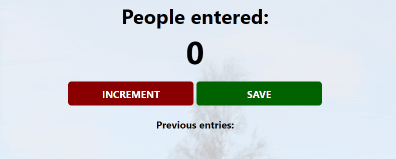
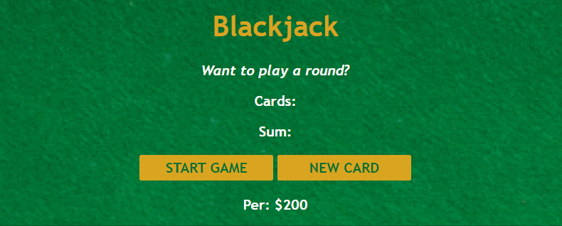

# Scrimba JS Course

Here's the solutions to [Scrimba JS Course](https://www.youtube.com/watch?v=jS4aFq5-91M) I've passed just to refresh my knowledge of JavaScript. It contains over 100 little challenges and 3 main projects:

* Subway Passenger Counter

* Blackjack Casino Game

* Chrome Extension

